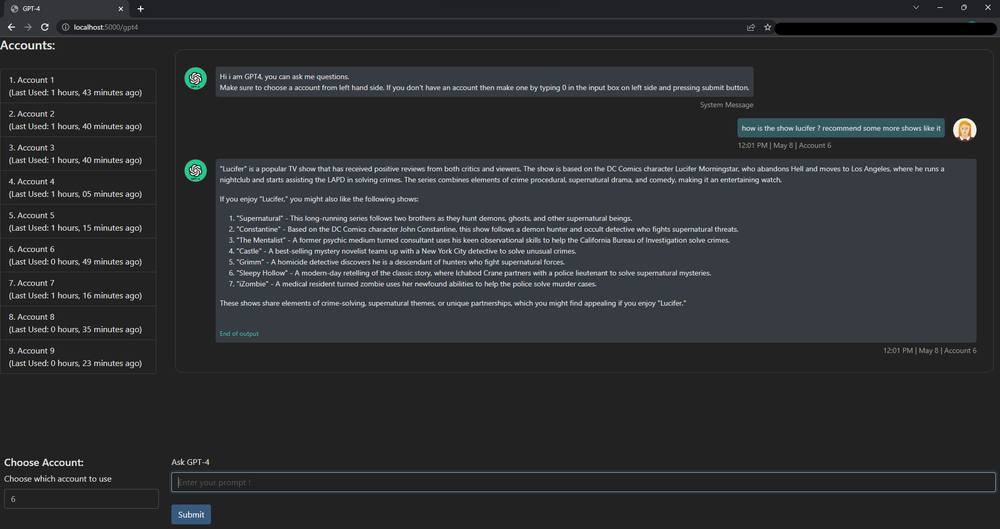
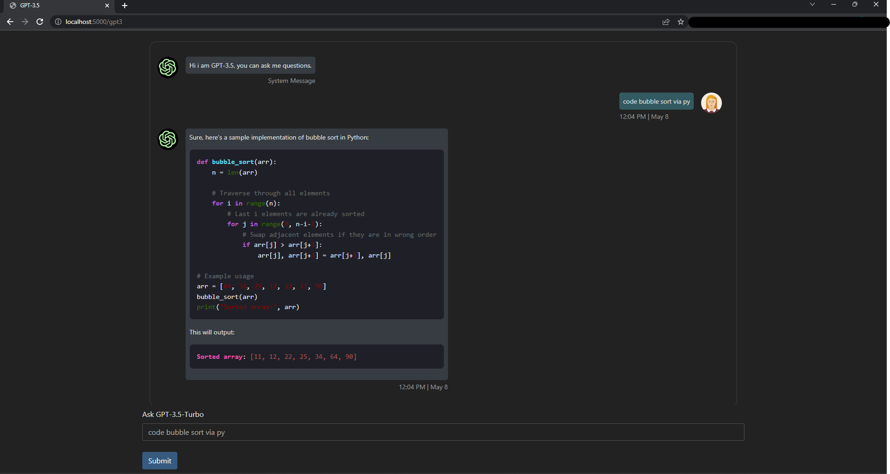

## Note: Forefront module is down for now till uesleibros fix it. [Forefront added additional security it seems]

- Uses forefront.ai for gpt-4
- Uses theb.ai for gpt-3.5

Actual Credits For gpt4 and gpt3.5 model:
1. [uesleibros-OpenGPT](https://github.com/uesleibros/OpenGPT)
2. [xtekky-gpt4free](https://github.com/xtekky/gpt4free/)

## Use gpt-4 and gpt-3.5 for free while it lasts.

## How to run ?
1. [Download this repository](https://github.com/jsmsj/GPT4/archive/refs/heads/master.zip)
2. Extract the files
3. Open terminal in extracted folder
4. Run `pip install -r requirements.txt`
5. Run `python main.py`
6. Go to [localhost:5000](http://127.0.0.1:5000)

> No need to create accounts manually, the script will autocreate and verify

## Note:
For forefornt.ai has a 5 message per 3 hour limit for gpt4, so you might have to switch accounts.
Join the [Discord](https://discord.gg/bDdErNVGeW) server if you face any issues.

## Images:

### GPT4:

### GPT-3.5-Turbo

